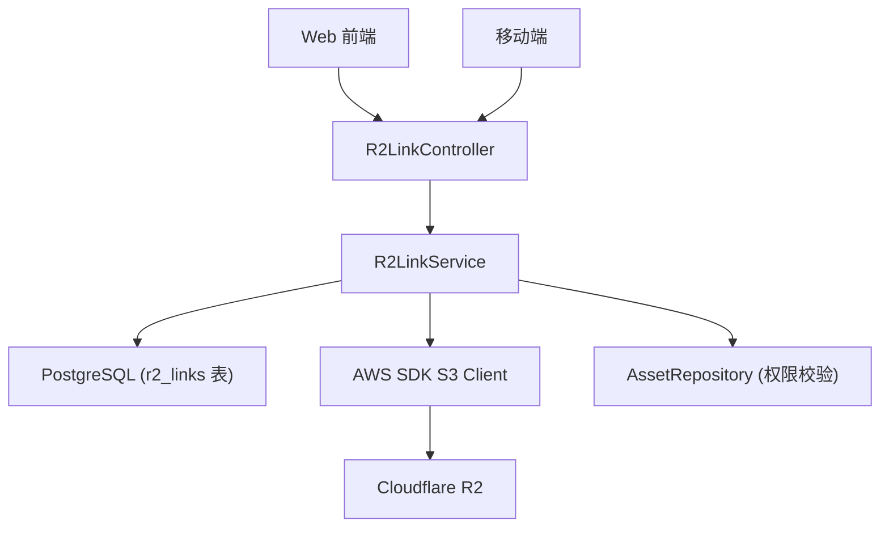

# R2 直链提取 - 技术设计

Feature Name: r2-direct-link
Updated: 2026-08-16

## 描述

在 Immich 中新增 R2 直链生成功能，支持用户在 Web 和移动端为资产生成 Cloudflare R2 预签名 URL，并管理已生成的链接。

## 架构



## 组件和接口

### 服务端

#### 新增模块：`R2LinkModule`

**文件位置：**
- `server/src/controllers/r2-link.controller.ts` - API 控制器
- `server/src/services/r2-link.service.ts` - 业务逻辑
- `server/src/entities/r2-link.entity.ts` - 数据库实体
- `server/src/repositories/r2-link.repository.ts` - 数据访问层

#### R2LinkController

```
POST /api/r2-links        - 创建链接
GET  /api/r2-links        - 查询链接列表
DELETE /api/r2-links/:id  - 撤销单个链接
DELETE /api/r2-links      - 批量撤销链接
```

**POST /api/r2-links 请求体：**
```json
{
  "assetIds": ["uuid1", "uuid2"],
  "expiresIn": "1h"  // "1h" | "24h" | "7d" | "permanent"
}
```

**POST /api/r2-links 响应：**
```json
{
  "links": [
    {
      "id": "uuid",
      "assetId": "uuid",
      "url": "https://...",
      "expiresAt": "2026-08-16T12:00:00Z"
    }
  ]
}
```

#### R2LinkService

核心逻辑：
1. 接收 assetIds 和 expiresIn 参数
2. 校验用户对资产的所有权
3. 根据 assetId 查询原始文件路径（`asset.originalPath`）
4. 将本地路径转换为 R2 相对路径
5. 使用 AWS SDK S3 `getSignedUrl` 生成预签名 URL
6. 将链接信息写入数据库
7. 返回链接列表

**路径转换逻辑：**
- 本地路径：`/root/immich-tk/r2-immich-photo/upload/user-id/ab/cd/abcdef.jpg`
- 去除 UPLOAD_LOCATION 前缀
- 得到 R2 key：`upload/user-id/ab/cd/abcdef.jpg`

**R2 凭证注入：**
- 从 docker-compose 环境变量读取：`R2_ACCESS_KEY_ID`、`R2_SECRET_ACCESS_KEY`、`R2_ENDPOINT`、`R2_BUCKET_NAME`
- 在 `R2LinkModule` 中通过 `ConfigModule` 获取

### 数据库

#### 新增表：`r2_links`

```
Column          | Type        | Description
----------------|-------------|------------------
id              | uuid        | 主键
assetId         | uuid        | 关联资产 ID
userId          | uuid        | 创建者 ID
url             | text        | 预签名 URL
expiresAt       | timestamptz | 过期时间 (NULL = 永久)
createdAt       | timestamptz | 创建时间
revokedAt       | timestamptz | 撤销时间 (NULL = 有效)
```

### Web 前端

#### 资产详情页
- 在操作菜单添加"获取 R2 直链"选项
- 点击弹出有效期选择对话框
- 生成后显示链接和复制按钮

#### 批量操作
- 时间线/相册视图多选资产后，工具栏显示"批量获取 R2 直链"
- 操作流程同单个

#### 链接管理页
- 路由：`/settings/r2-links`
- 列表展示：资产缩略图、文件名、创建时间、有效期、状态
- 支持单个撤销和批量撤销

### 移动端

#### 资产详情页
- 在操作菜单添加"获取 R2 直链"选项
- 弹出有效期选择 BottomSheet
- 生成后显示链接和复制按钮

#### 批量操作
- 多选资产后工具栏添加"批量获取 R2 直链"

#### 链接管理页
- 设置页面添加"R2 直链管理"入口
- 列表展示同 Web

## 正确性约束

1. 用户只能访问自己拥有的资产
2. 撤销操作必须是链接创建者本人
3. 路径转换必须验证 UPLOAD_LOCATION 前缀匹配
4. 永久链接不设置 expiresAt，但记录在数据库中以便管理

## 错误处理

| 场景 | 处理 |
|------|------|
| 资产不存在 | 返回 404 |
| 资产不属于当前用户 | 返回 403 |
| 原始文件不存在 | 返回 400 "无原始文件" |
| R2 凭证未配置 | 返回 500 "R2 未配置" |
| 链接已过期 | 返回 410 "链接已过期" |
| 链接已撤销 | 返回 410 "链接已撤销" |

## 测试策略

1. 单元测试：`R2LinkService` 路径转换和链接生成逻辑
2. 集成测试：API 接口的认证和权限校验
3. E2E 测试：Web 前端完整操作流程